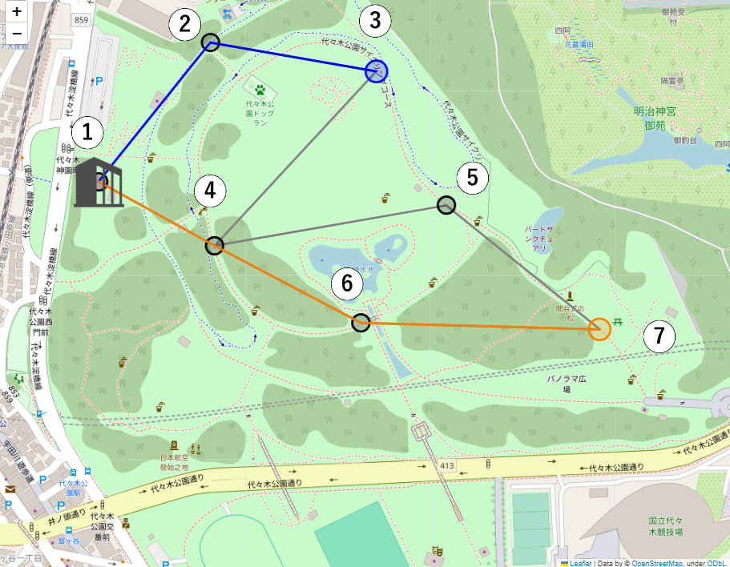

# ESP32
### 概要
本アプリケーションにおいて，ESP32はセンサデバイスからサーバまでの通信経路の構築とトイレの利用人数とゴミ箱の堆積率のデータを取得し，サーバまで送信を行う．サーバまで送信されたデータは処理された後にダッシュボードで可視化されて施設管理の効率化と機器管理に役立てられる．トイレの利用人数とゴミ箱の堆積率のデータは距離センサから取得した値を用いている．  
サーバ側のプログラムは[flask](https://github.com/Fel615/IoTDojo_fri2nd/tree/main/flask)に詳細が記載されている．また，主な使用言語は`MicroPython`である．

### ディレクトリ
・直下のディレクトリの概要  
1. **relay01**: サーバ/中継器 双方と通信を行う中継器1．  
2. **relay02**: センサ/中継器 双方と通信を行う中継器2．  
3. **relay04**: センサ/中継器/サーバ と通信を行う中継器4．  
4. **relay05**: センサ/中継器 双方と通信を行う中継器5．  
5. **relay06**: センサ/中継器 双方と通信を行う中継器6．  
6. **senser1**: トイレの利用人数データを中継器を通してサーバまで送信する．デバイス名3．  
7. **senser2**: ゴミ箱の堆積率データを中継器を通してサーバまで送信する．  デバイス名7．

・直下の各ディレクトリ内に存在するディレクトリ
1. **data**: 経路表などを保存する．  
2. **info**: デバイスの基本情報を保存する．  

### ファイル
・直下ディレクトリ内に存在するファイルの概要
1. **BLE_advertising.py**: BLEデバイスのAdvertising Payloadを生成する．
2. **_central.py**: スキャンを行い，Advertising Payloadを受信する．
3. **_peripheral.py**: Advertising Payloadを通じて周囲に情報をブロードキャストする．
4. **boot.py**: wifi接続を担う．
5. **distance_manegement.py**: 距離センサのデータ送受信を一括管理する．
6. **distance_sendtoserver.py**: センサデータをサーバへ送信する．
7. **led.py**: 外部接続をしたLEDの光り方を制御，確認する．
8. **makeroute**: 経路情報やデバイス情報から経路表を作成する．
9. **manegement.py**: 各デバイスの処理を一括管理する．
10. **mode_change.py**: Advertising Payloadを受け取る条件分岐を行う．
12. **routedata_getfromserver.py**: 経路データをサーバから取得する．
13. **routedata_sendtoserver.py**: 経路データをサーバへ送信する．
14. **route_manegement.py**: 経路データの送受信を一括管理する．

・ディレクトリ"data"内に存在するファイル．  
1. **packet_table.json**: 経路表を作成する際に用いるデータを保存．

・ディレクトリ"info"内に存在するファイル．  
1. **DNXX.json**: デバイス情報や様々な条件で使い分けるパケット名を保存．(XXは各デバイス番号)

### 経路マップ

     

### 特徴
1. **経路構築**: 本システムはセンサデータを送信する為に各センサデバイスからサーバまでの経路構築を順に行う．経路構築の為の通信では"センサ名_中継器名_サーバ名_ホップ数"というデータが送信される．ホップ数とはセンサからサーバへデータを送信する際に中継した中継器の数としている．本システムではホップ数とサーバへのデータ到着順で経路の優先度としており，複数存在する経路を管理している．

2. **センサデータ取得**: 本システムは距離センサ`vL53L0X使用レーザ測距センサモジュール（ToF）`を用いてトイレとゴミ箱で計測を行い必要に応じて加工した後"センサ名_データ_壊れた中継器(デフォルトは0)"に代入して定期送信を行う．  
→ ゴミ箱ではゴミの堆積量を取得することが求められている．上蓋から下に距離を計測し，測定した距離を"センサ名_距離_壊れた中継器(デフォルトは0)"というデータに代入してサーバまで送信する．  
→ トイレでは利用人数のデータが必要一定時間中に0.5秒毎に距離を計測し，その距離が7割以下となった際に人が通過したと認識し，カウントを増やす．トイレに入った人は必ず出て行くのでカウントを2で割った値が大まかな利用人数と言える．この値を"センサ名_人数_壊れた中継器(デフォルトは0)"というデータに代入してサーバまで送信する．

### 必要条件  
1. micropython(firmware)  
2. ESP32-WROOM-32E開発ボード4MB  
3. VL53L0X使用 レーザー測距センサモジュール（ToF）
4. Thonny  
5. webrepl

### セットアップ
1. **開発環境の構築1 (インストール)**  

   1.1. Thonnyインストーラーのダウンロード．  
   > [Thonny, Python IDE for beginners](https://thonny.org/)にアクセスし，`thonny-4.0.1.exe`をダウンロード．
 
   1.2. アプリケーションのインストール．  
   > [こちら](https://logikara.blog/raspi-pico-thonny-micropy/)を参考にThonnyのインストールを完了させる.  

2. **開発環境の構築2 (セットアップ)**
   2.1. Thonnyのセットアップ．    

3. **実行準備**
   3.1. デバイスに実行用ファイルを保存．  
   3.2. 実行．  
### 主要機能
#### Central
1. **BLEDevCentral** centralクラス  
   1.1. **__init__** 初期化関数  
   1.2. **_reset** 値のリセット関数  
   1.3. **_irq** イベント処理関数  
   1.4. **is_connected** 接続確立確認関数  
   1.5. **scan** Advertising Payloadを受信する関数  
   1.6. **not_scan** 受信を停止する関数  
   1.7. **connect** デバイスに接続する関数  
   1.8. **disconnect** デバイスから切断する関数  
   1.9. **read** データを読み込み，コールバックを呼び出す関数  
   1.10. **on_notify** デバイスからの通知時の関数  
   1.11. **_update_value** データのアップデートを行う関数  
   1.12. **vlue**　取得データを返す関数  
   
   

### 参考文献
- [ubluetooth -- 低レベル Bluetooth - MicroPython - Read the Docs](https://micropython-docs-ja.readthedocs.io/ja/v1.16ja/library/ubluetooth.html)
- [VL53L0X使用　レーザー測距センサモジュール（ToF）](https://akizukidenshi.com/catalog/g/gM-12590/)
